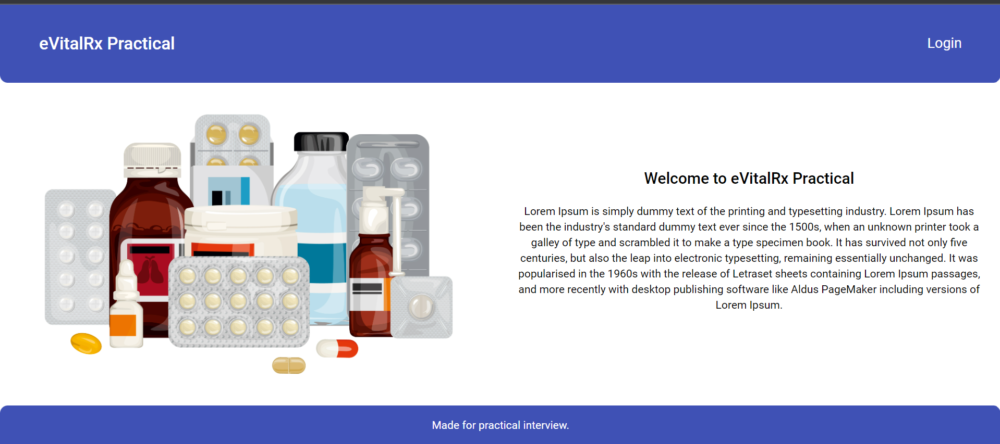
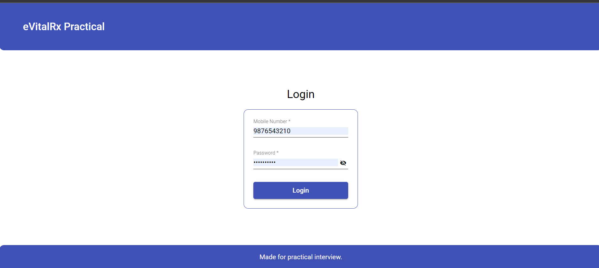
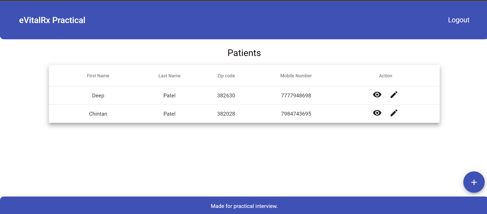
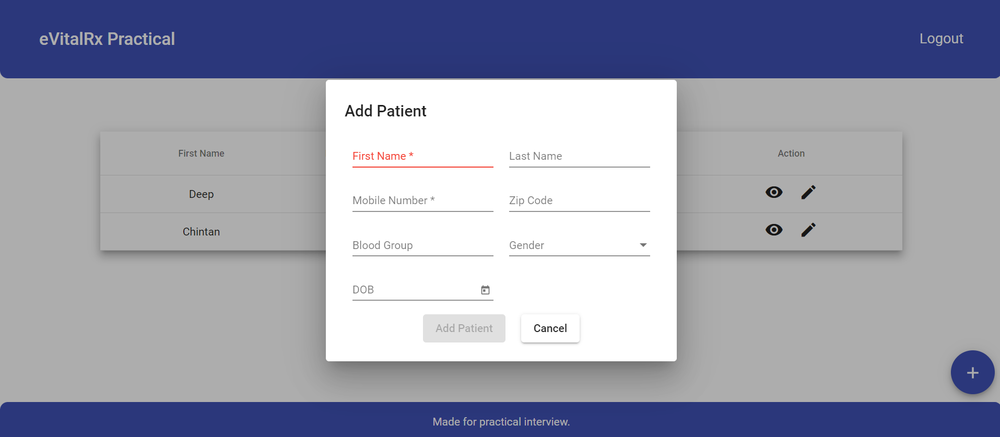
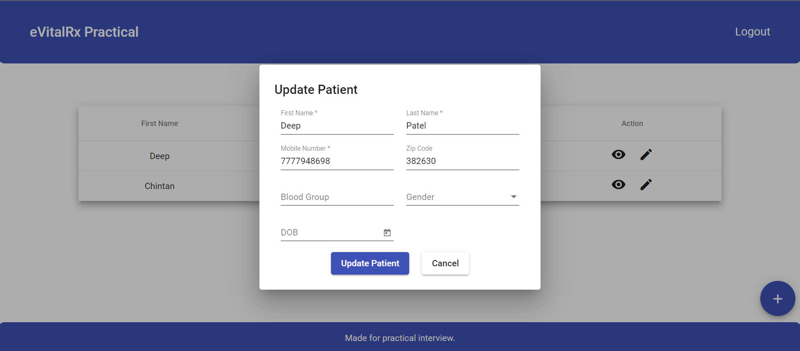
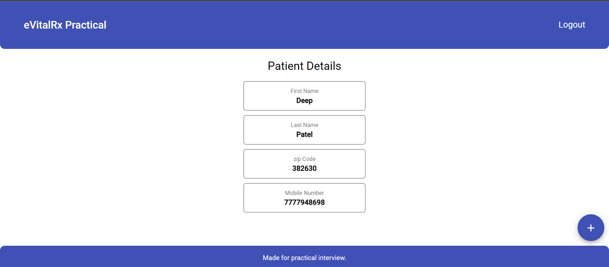
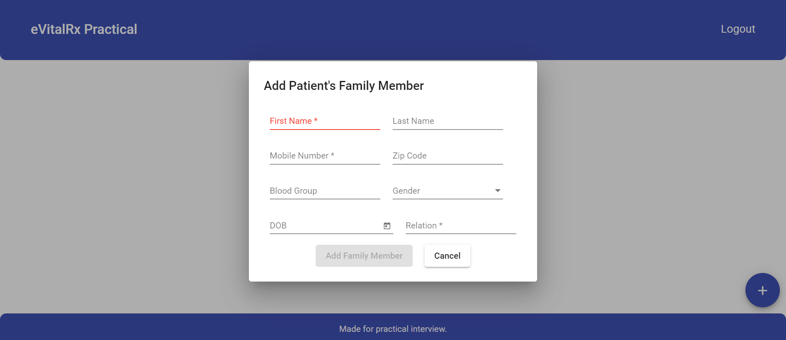

# EVitalRx Practical

## Run Project

Run `ng serve` for a dev server. Navigate to `http://localhost:4200/`. It will navigate to landing page. Or you can see project live on [`https://e-vital-rx-practical.vercel.app/`](https://e-vital-rx-practical.vercel.app/)

## Login

Login credentials
```bash
Mobile: 9876543210
Password: test@admin
```

## Screenshots

Landing


Login


Dashboard


Add Patient


Update Patient


View Patient Details


Add Patient's Family Member


